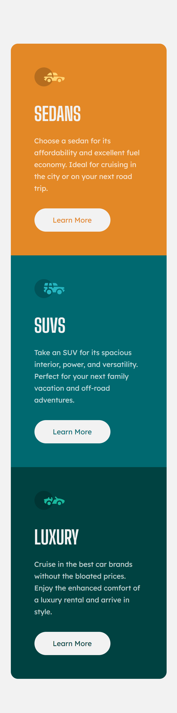
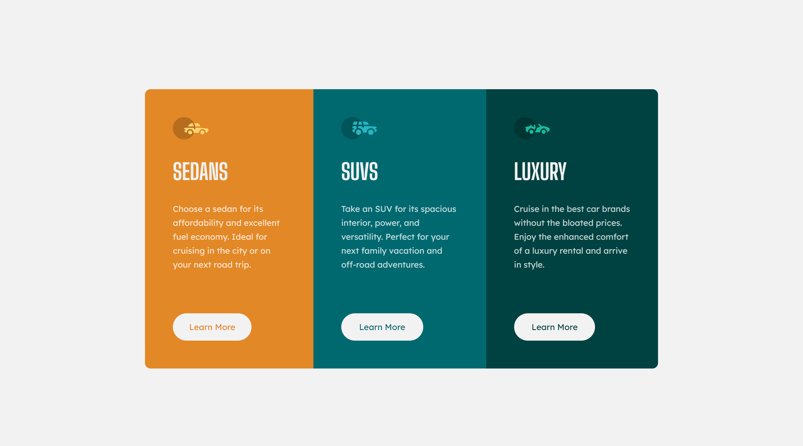

# Frontend Mentor - 3-column preview card component solution

This is a solution to the [3-column preview card component challenge on Frontend Mentor](https://www.frontendmentor.io/challenges/3column-preview-card-component-pH92eAR2-).

## Table of contents

- [Overview](#overview)
  - [The challenge](#the-challenge)
  - [Screenshot](#screenshot)
  - [Links](#links)
- [My process](#my-process)
  - [Built with](#built-with)
  - [What I learned](#what-i-learned)
- [Author](#author)


## Overview

### The challenge

Users should be able to:

- View the optimal layout depending on their device's screen size
- See hover states for interactive elements

### Screenshot




### Links

- Live Site URL: [Live Site URL](https://your-live-site-url.com)

## My process

### Built with

- Semantic HTML5 markup
- CSS custom properties
- Flexbox
- CSS Grid

### What I learned

I learnt how to use the min-height property and the flex display to centralize content.

🎉New Code Snippets🎉:

```css
body {
    background-color: var(--very-light-gray);
    min-height: 100vh;
    display: flex;
    flex-direction: column;
    align-items: center;
    justify-content: center;
}
```

## Author

- Frontend Mentor - [@eby-coder](https://www.frontendmentor.io/profile/eby-coder)
- LinkedIn - [Ebere Ndukwu](https://www.linkedin.com/in/ebere-ndukwu-584722249/)
- Twitter - [@EPN](https://twitter.com/EPN39_5)